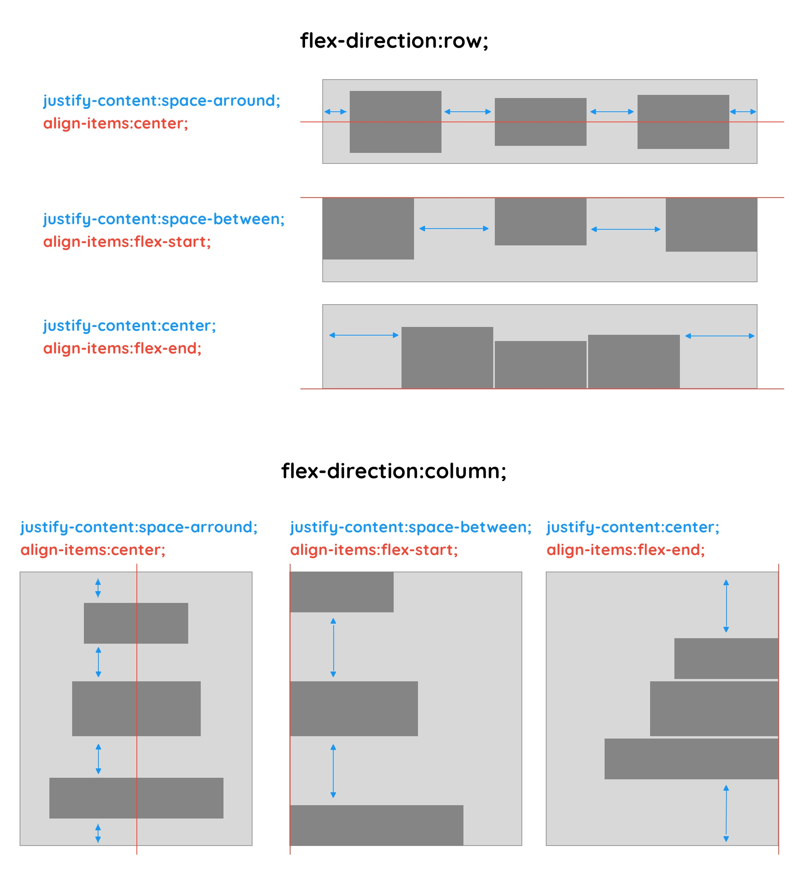

# FLEXBOX style


The parent node can automatically arrange its children with css style `display:flex;`


Ex :

```
<div style="display:flex;flex-direction:column;justify-content:center;">
  <div class="elementA"/>
  <div class="elementB"/>
  <div class="elementC"/>
</div>
```
or
```
<style>
  .flex-exemple {
    display:flex;
    flex-direction:column;
    justify-content:center;
  }
</style>

<div class="flex-exemple">
  <div class="elementA"/>
  <div class="elementB"/>
  <div class="elementC"/>
</div>

```


